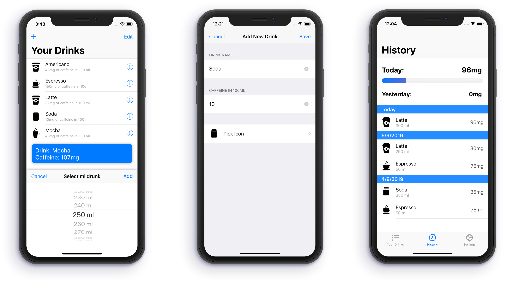

# Caffeine-tracker
> Log your caffeine beverage easily!.

This app let's you log your caffeine and water intake to the health app. Simply select one of the presets or add your own drink.

## Features
* Easily log your daily caffeine consumption
* Log your water intake too!
* Connection to the Health App
* Multiple Types of drinks
* Add your own!
* Use "ml" or "oz" (*Soon...*)
* Beautiful progress bar



## Release History

* 0.4.0
  * ADD: Onboarding Screen
* 0.3.0
  * History section implemented
* 0.2.1
  * Progress bar implemented
  * Bare bones of inApp purchase implemented
* 0.1.2
  * Health implementation finished
* 0.1.0
  * UI finished!
  * ADD: Started implementing Health API
* 0.0.1
  * Development Started

## Meta

Tobias Ruano – [@tobiasruano](https://twitter.com/tobiasruano) – truano@uade.edu.ar

Distributed under the Apache License. See ``LICENSE`` for more information.

[https://github.com/TobiasRuano/Caffeine-tracker](https://github.com/TobiasRuano/Caffeine-tracker)

## Contributing

1. Fork it (<https://github.com/tobiasruano/Caffeine-tracker/fork>)
2. Create your Feature Branch (```git checkout -b feature/AmazingFeature```)
3. Commit your Changes (```git commit -m 'Add some AmazingFeature```)
4. Push to the Branch (```git push origin feature/AmazingFeature```)
5. Create a new Pull Request
