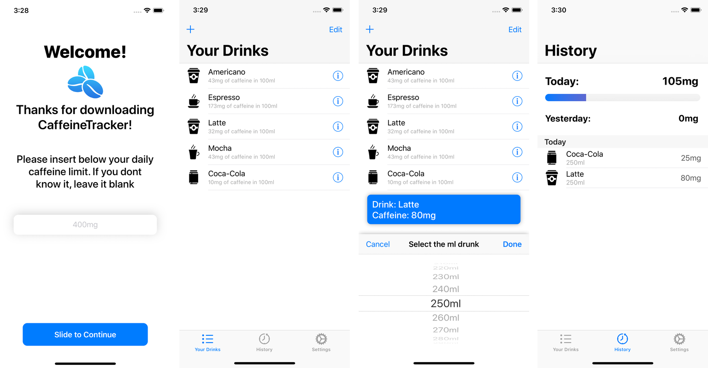

> Log your caffeine beverage easily!.

Caffeine Tracker is the best app to track your daily caffeine consumption. It has an easy to use interface that lets you track any drink in seconds! 
Inside the history tab, you can have a more detailed view at your day and see how much more caffeine you should drink today.

## Features
* Easily log your daily caffeine consumption
* Log your water intake too!
* Connection to the Health App
* Multiple Types of drinks
* Add your own drinks!
* Support for "ml" & "fl oz"
* Set your caffeine daily limit.
* Clean & intuitive Interface

## Change Log

| Version         | Changes         | Release date         |
| ------------- | ------------- | ------------------ |
| 1.1.1     | {::nomarkdown}<ul><li>Fixed iOS 13 compatibility issues</li><li>Fixed separator color issues in History tab</li></ul>{:/}       | 20/09/19 |
| 1.1       | {::nomarkdown}<ul><li>Fl oz support</li><li>New about screen</li><li>Bug fixes</li></ul>{:/}        | 13/09/19 |
| 1.0.2       | {::nomarkdown}<ul><li>Ability to delete added drinks inside the History tab (just swipe and confirm!)</li><li>The drinks inside the history tab are now slightly bigger</li><li>if one day you surpass your daily limit, the day separator inside the history tab will now turn red for that day</li></ul>{:/}        | 4/09/19 |
| 1.0.1       | {::nomarkdown}<ul><li>Fixed a bug that made the text be displayed incorrectly</li><li>Other small tweeks</li></ul>{:/}        | 28/08/19 |
| 1.0       | {::nomarkdown}<ul><li>Release</li></ul>{:/}        | 26/08/19 |

## Info

[Privacy Policy](https://caffeinetracker.tobiasruano.com/privacy)

Tobias Ruano – [@tobiasruano](https://twitter.com/tobiasruano) – truano@uade.edu.ar
